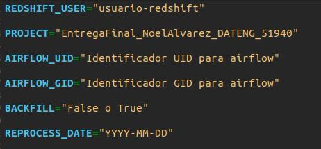

# Proyecto Final del Curso de Data Engineer Flex - Comision 51940

Se uso la api newsapi.org como requerimiento para desarrollo del entregable. 
A continuacion esta el enlace de la pagina:

https://newsapi.org/

Se decidio usar el endpoint "Top headlines".

Una vez clonado el repositorio, se debe tener en cuenta lo siguiente:

* Crear un archivo ".env":
  
  Dicho archivo contiene algunas variables de entorno necesarias para el funcionamento del proyecto. 
  El Archivo ".env_template", es una plantilla de como deberia estar formado el archivo .env.
  Es posible modificarlo, sustituir los valores correspondiente de cada variable y cambiarle el nombre a ".env".
  
  
  
* Crear las siguientes carpetas a la misma altura del `docker-compose.yaml`.

```bash
mkdir -p dags,logs,plugins,data
```
* Ejecutar el siguiente comando para levantar los servicios de Airflow.

```bash
docker-compose up --build
```
* Una vez que los servicios estén levantados, ingresar a Airflow en `http://localhost:8080/`.

* En la pestaña `Admin -> Connections` crear una nueva conexión con los siguientes datos para Redshift:

    * Conn Id: `redshift_default`
    * Conn Type: `Amazon Redshift`
    * Host: `host de redshift`
    * Database: `base de datos de redshift`
    * Schema: `esquema de redshift`
    * User: `usuario de redshift`
    * Password: `contraseña de redshift`
    * Port: `5439`
  
 En la pestaña `Admin -> Variables` crear las siguientes variables de entorno para el funcionamient de la API:

    * APIKEY: `key de la api news-Api.org`
    * TOP_HEADLINES_URL: `https://newsapi.org/v2/top-headlines`


